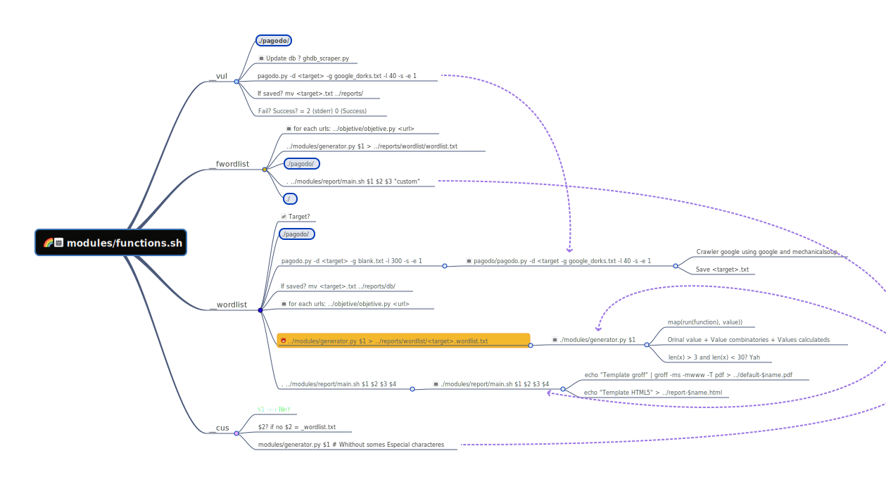

# Hello, World!

Thanks for your interest in making D4N155 -- and therefore, the
world -- There are mutliple ways to help beyond just writing code:
 - [Submit bugs and feature requests] with detailed information about your issue or idea.
 - [Help fellow users with open issues] or [help fellow committers test recent pull requests].

# Contributing to D4N155
If you want help for undestand the code contact us jul10l1r4@disroot.org (Julio Lira), matheusoliveiratux4me@gmail.com (Matheus Oliveira) or x4fUz_K39z@tutanota.com (@sophiesch0ll)
## Understand the code

