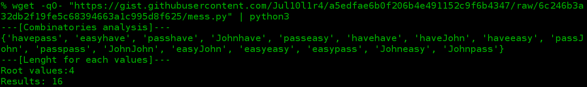

# Operation of D4N155
The process of password speculation works based on the execution of several functions of theories mathematics.
## Combinatorial analysis

The code follow the combinatorial analysis during the process of speculation

## Enumerative combinatorics

> Enumerative combinatorics is the most classical area of combinatorics and concentrates on counting the number of certain combinatorial objects.


Using crawler are possible get all values for each all urls

## Analytic combinatorics

>Analytic combinatorics concerns the enumeration of combinatorial structures using tools from complex analysis and probability theory. In contrast with enumerative combinatorics, which uses explicit combinatorial formulae and generating functions to describe the results, analytic combinatorics aims at obtaining asymptotic formulae. 

This is the most important thing for code.


With all the possibilities of combinations, example:
```
Root text: i walk
---- Tests ----
1,1: walk i
1,2: walki
2,1: i walk
2,2: iwalk

Removed repeated words
------------------------
walk i
walki
iwalk
```
Using this [script](https://gist.github.com/Jul10l1r4/a5edfae6b0f206b4e491152c9f6b4347) are possible see in practical
with 4 values `"John","have","easy","pass"`, run:
```bash
wget -qO- "https://gist.githubusercontent.com/Jul10l1r4/a5edfae6b0f206b4e491152c9f6b4347/raw/6c246b3a32db2f19fe5c68394663a1c995d8f625/mess.py" | python3
```



